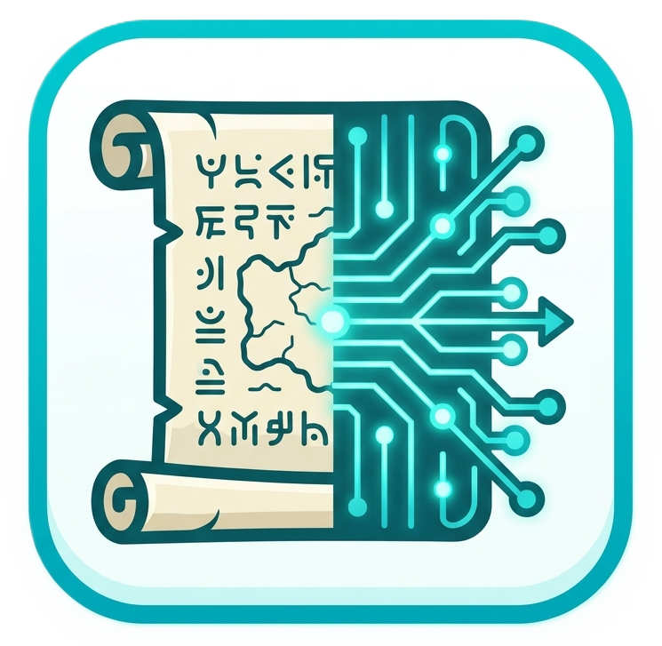
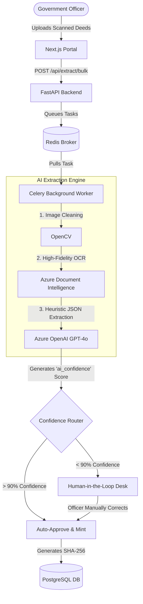

<div align="center">
  
  <h1>N.A.K.S.H.A.</h1>
  <p><strong>Neural Archival Knowledge & Script Heuristic Analyzer</strong></p>
  <p><i>An Enterprise-Grade, AI-Powered Government Land Record Digitization & Verification System</i></p>

  <!-- Tech Stack Badges -->
  
  
  
  
  
  
</div>

<br/>

## 🚀 The Vision: Solving India's Legacy Data Crisis
Land records in India form the absolute backbone of civil administration, rural development, and property ownership. However, centuries of legacy records exist in physical archives as fragile, faded, handwritten, and multilingual documents. The current approach of manual human digitization is disastrously slow, highly susceptible to clerical errors, and incredibly vulnerable to deliberate tampering and forgery.

**N.A.K.S.H.A.** (Neural Archival Knowledge & Script Heuristic Analyzer) completely revolutionizes this process. It is a cloud-native, asynchronous AI pipeline that rapidly ingests thousands of legacy documents simultaneously. By leveraging state-of-the-art Vision-Language Models (Azure Document Intelligence & GPT-4o), it pierces through severe document degradation to extract highly structured JSON entities (Khasra numbers, Owner details, Plot Areas). 

Instead of replacing human workers, it empowers them through a strict heuristic confidence scoring system. Documents that score above a 90% confidence threshold are automatically verified, instantly clearing massive backlogs. Edge cases are seamlessly routed to a split-screen Human-in-the-Loop desk for Magistrate review. Finally, every verified document is irreversibly minted to a cryptographic SHA-256 ledger, eliminating forgery once and for all.

---

## 🧠 System Architecture



---

## 🌟 Core Features (The 7 Phases)

1. **Multi-Tenant JWT Security:** A secure gateway that restricts Officers to their specific State Jurisdiction (e.g., West Bengal vs Maharashtra). Includes cryptographic Self-Service Password Reset (SSPR).
2. **Bulk Digitization Node:** Drag-and-drop ingestion interface handling thousands of PDFs simultaneously without locking the user interface.
3. **Asynchronous AI Engine:** Background Celery workers pipe images through Azure Document Intelligence for structural layout OCR, and GPT-4o for exact schema JSON extraction.
4. **Auto-Approval Threshold Logic:** The AI mathematically scores its own extraction accuracy. If `confidence > 90%`, it bypasses human queues. If lower, it safely halts for manual review.
5. **Split-Screen Verification Desk (HITL):** A sleek, full-screen interface where Magistrates visually verify the original image against the AI's JSON output before finalizing the record.
6. **Cryptographic Blockchain Minting:** Upon approval, data is irrevocably sealed into a `SHA-256` hash.
7. **Public Validation Gateway:** Citizens can paste their Document Hash to instantly prove the authenticity of their land record and prevent forgery.

---

## 🛠️ How to Run Locally

### 1. Database & Broker
Ensure you have Docker Desktop installed, then spin up PostgreSQL and Redis:
```bash
docker-compose up -d
```

### 2. FastAPI Backend & AI Worker
Open two separate terminals in the `backend/` directory:
```bash
# Terminal 1: Run the API Server
python -m venv venv
.\venv\Scripts\activate
pip install -r requirements.txt
uvicorn app.main:app --reload

# Terminal 2: Run the Celery AI Processing Queue
.\venv\Scripts\activate
celery -A app.worker.celery_app worker --loglevel=info -P gevent
```

### 3. Next.js Portal
Open a terminal in the `naksha-portal/` directory:
```bash
npm install
npm run dev
```

---
*Built with 💙 by Team **6Bytes** for the **Smart India Hackathon 2026**.*
