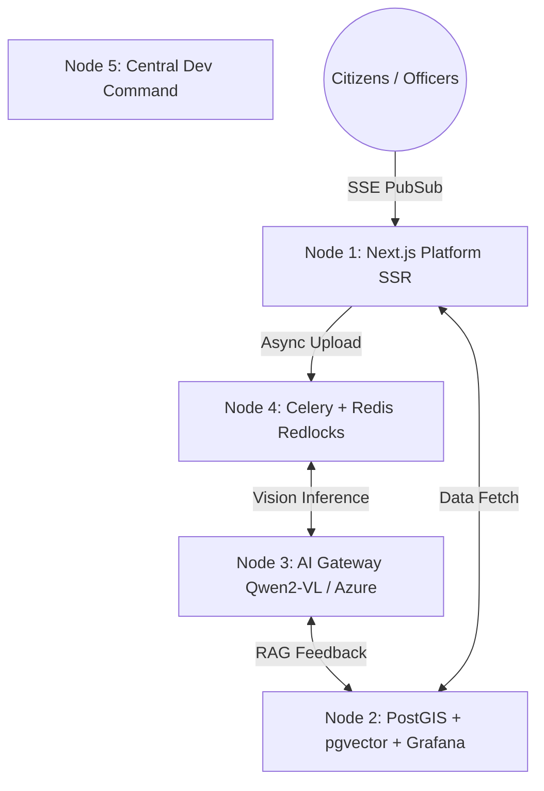

<div align="center">
  
  <h1>N.A.K.S.H.A.</h1>
  <p><strong>Neural Archival Knowledge & Script Heuristic Analyzer</strong></p>
  <p><i>An Enterprise-Grade, AI-Powered Government Land Record Digitization & Verification System</i></p>

  <!-- Tech Stack Badges -->
  
  
  
  
  
  
  
  
</div>

<br/>

## 🏆 Phase II: The Grand Final Build (SIH National Selection)
*This section represents the refactored **final build** architecture targeted for the Smart India Hackathon (SIH) National Grand Finale.* 

N.A.K.S.H.A. has evolved from a prototype MVP into a highly scalable, decoupled **5-Node Microservices Fleet**. It is designed to ingest centuries of faded, handwritten, multilingual Indian land records and convert them into cryptographically secure, georeferenced digital assets with zero-latency dispute resolution.

### 🏛️ Enterprise 5-Node Architecture



### 🔥 Key Technical Innovations

#### 1. Dual AI Sovereignty & Hybrid Learning Loop
* **Local Data Privacy:** Defaults to a locally hosted **Qwen2-VL-7B (8-bit)** Vision-Language Model to process complex Bengali/Hindi ligatures entirely on-premise. Azure OpenAI acts purely as a failover.
* **Instant Few-Shot RAG:** When Magistrates correct OCR errors, `pgvector` immediately embeds the correction for instant contextual learning on future deeds.
* **Scheduled LoRA:** Every 1,000 corrections, a background cron job fine-tunes the base model using Low-Rank Adaptation (LoRA) without catastrophic forgetting.

#### 2. Zero-Trust RBAC & India Stack Integration
* **Unified Auth:** 3-Tier Login separating Citizens, Govt Magistrates, and Devs. 
* **DigiLocker Push URI:** We do not unsafely upload raw PDFs. The Next.js portal implements India Stack's official OAuth and exposes a `/pull` endpoint so DigiLocker apps can fetch verified Property Deeds securely and dynamically.

#### 3. Autonomous PostGIS Dispute Engine
* **Zero-Latency Collision Detection:** Instead of heavy Python math, land overlaps are caught instantly by a PostgreSQL `BEFORE INSERT` trigger leveraging **GiST spatial indexing** and `ST_Intersects()`.

#### 4. Mathematical Concurrency & Scaling
* **Celery Redlocks:** Utilizing Redis `SETNX` distributed locks to ensure multiple horizontal worker containers mathematically cannot process the same deed twice.
* **SSE (Server-Sent Events):** Escaping standard 60-second HTTP load-balancer timeouts by streaming AI generation progress live via Redis Pub/Sub directly to the Next.js client.

#### 5. Cryptographic Vault & Offline Verification
* **SHA-256 Deduplication:** Database-level uniqueness constraints on deed hashes to automatically rollback forged or tampered record uploads.
* **ReportLab Offline PDFs:** Dynamically generated print-ready deeds stamped with QR codes allowing citizens without internet to present cryptographically verifiable papers.

---

## 🏗️ Phase I: Pre-MVP (Foundation)
*This section documents the initial MVP baseline constructed during the internal college hackathon rounds.*

### 🚀 The Vision: Solving India's Legacy Data Crisis
Land records in India form the absolute backbone of civil administration, rural development, and property ownership. However, centuries of legacy records exist in physical archives as fragile, faded, handwritten, and multilingual documents. The current approach of manual human digitization is disastrously slow, highly susceptible to clerical errors, and incredibly vulnerable to deliberate tampering and forgery.

**N.A.K.S.H.A.** completely revolutionizes this process. It is a cloud-native, asynchronous AI pipeline that rapidly ingests thousands of legacy documents simultaneously. By leveraging state-of-the-art Vision-Language Models (Azure Document Intelligence & GPT-4o), it pierces through severe document degradation to extract highly structured JSON entities. 

Instead of replacing human workers, it empowers them through a strict heuristic confidence scoring system. Documents that score above a 90% confidence threshold are automatically verified, clearing massive backlogs. Edge cases are routed to a split-screen Human-in-the-Loop desk for Magistrate review.

### 🧠 Pre-MVP System Architecture


### 🌟 Phase I Core Features

1. **Multi-Tenant JWT Security:** A secure gateway that restricts Officers to their specific State Jurisdiction.
2. **Bulk Digitization Node:** Drag-and-drop ingestion interface handling thousands of PDFs simultaneously.
3. **Asynchronous AI Engine:** Background Celery workers pipe images through Azure for OCR and exact JSON extraction.
4. **Auto-Approval Threshold Logic:** The AI mathematically scores its own extraction accuracy. If `confidence > 90%`, it bypasses queues.
5. **Split-Screen Verification Desk (HITL):** A sleek, full-screen interface where Magistrates visually verify the original image against the AI's JSON output.
6. **Public Validation Gateway:** Citizens can paste their Document Hash to instantly prove authenticity.

---

## 🛠️ How to Run Locally

### 1. Database & Broker
Ensure you have Docker Desktop installed, then spin up PostgreSQL and Redis:
```bash
docker-compose up -d
```

### 2. FastAPI Backend & AI Worker
Open two separate terminals in the `backend/` directory:
```bash
# Terminal 1: Run the API Server
python -m venv venv
.\venv\Scripts\activate
pip install -r requirements.txt
uvicorn app.main:app --reload

# Terminal 2: Run the Celery AI Processing Queue
.\venv\Scripts\activate
celery -A app.worker.celery_app worker --loglevel=info -P gevent
```
*(For Phase II: Ensure 5-Node setup via `docker-compose up --build -d --scale worker=3`)*

### 3. Next.js Portal
Open a terminal in the `naksha-portal/` directory:
```bash
npm install
npm run dev
```

---
*Built with 💙 by Team **6Bytes** for the **Smart India Hackathon 2026**.*
